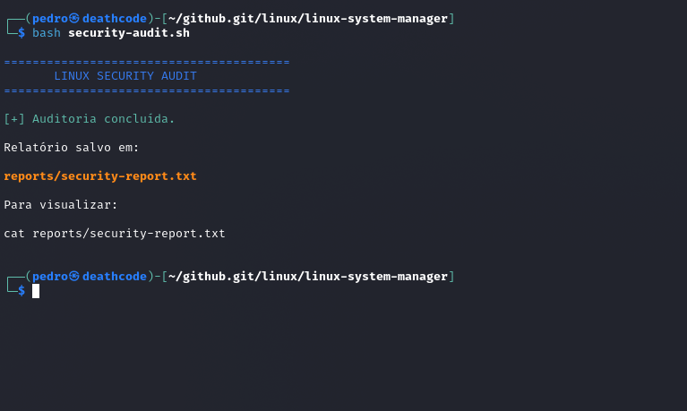

# 🐚 Shell Scripting: do básico à automação


<p align="center">
  
</p>


Guia prático de programação em **Shell Script (Bash)** com exemplos comentados, exercícios e scripts úteis para administração de sistemas e segurança da informação.


---

## 📚 Sumário

1. [O que é Shell Script](#-o-que-é-shell-script)
2. [Primeiro script](#-primeiro-script)
3. [Variáveis](#-variáveis)
4. [Entrada e saída](#-entrada-e-saída)
5. [Condicionais](#-condicionais)
6. [Laços de repetição](#-laços-de-repetição)
7. [Funções](#-funções)
8. [Argumentos e códigos de saída](#-argumentos-e-códigos-de-saída)
9. [Redirecionamento e pipes](#-redirecionamento-e-pipes)
10. [Boas práticas](#-boas-práticas)
11. [Scripts de exemplo](#-scripts-de-exemplo)
12. [Estrutura do repositório](#-estrutura-do-repositório)
13. [Recursos para estudo](#-recursos-para-estudo)

---

## 🔹 O que é Shell Script

Shell Script é um arquivo de texto com comandos que o interpretador (shell) executa em sequência. Serve para **automatizar tarefas repetitivas**: backups, monitoramento, varreduras, parsing de logs, deploys, etc.

---

## 🔹 Primeiro script

```bash
#!/bin/bash
# hello.sh - meu primeiro script

echo "Olá, mundo!"
```

Dar permissão e executar:

```bash
chmod +x hello.sh
./hello.sh
```

> A primeira linha (`#!/bin/bash`) é o **shebang**: indica qual interpretador usar.

---

## 🔹 Variáveis

```bash
#!/bin/bash

nome="Pedro"
idade=20

echo "Nome: $nome"
echo "Idade: ${idade} anos"

# Saída de um comando em variável
data=$(date +%d/%m/%Y)
echo "Hoje é $data"

# Variáveis somente leitura
readonly VERSAO="1.0"
```

| Variável | Significado |
|----------|-------------|
| `$0` | Nome do script |
| `$1 ... $9` | Argumentos posicionais |
| `$#` | Quantidade de argumentos |
| `$@` | Todos os argumentos |
| `$?` | Código de saída do último comando |
| `$$` | PID do processo atual |

---

## 🔹 Entrada e saída

```bash
#!/bin/bash

read -p "Qual é o seu nome? " nome
read -s -p "Senha: " senha   # -s não exibe o que é digitado
echo
echo "Bem-vindo, $nome!"
```

---

## 🔹 Condicionais

```bash
#!/bin/bash

read -p "Digite um número: " n

if [ "$n" -gt 10 ]; then
    echo "Maior que 10"
elif [ "$n" -eq 10 ]; then
    echo "Igual a 10"
else
    echo "Menor que 10"
fi
```

**Operadores comuns**

| Números | Strings | Arquivos |
|---------|---------|----------|
| `-eq` igual | `=` igual | `-f` é arquivo |
| `-ne` diferente | `!=` diferente | `-d` é diretório |
| `-gt` maior | `-z` vazia | `-e` existe |
| `-lt` menor | `-n` não vazia | `-r` `-w` `-x` permissões |

### `case`

```bash
case "$1" in
    start)   echo "Iniciando..." ;;
    stop)    echo "Parando..." ;;
    *)       echo "Uso: $0 {start|stop}" ;;
esac
```

---

## 🔹 Laços de repetição

```bash
# for
for i in 1 2 3 4 5; do
    echo "Número: $i"
done

# for estilo C
for ((i=0; i<5; i++)); do
    echo "i = $i"
done

# percorrer arquivos
for arq in *.txt; do
    echo "Arquivo: $arq"
done

# while
contador=1
while [ $contador -le 5 ]; do
    echo "Contagem: $contador"
    ((contador++))
done

# ler um arquivo linha a linha
while IFS= read -r linha; do
    echo "$linha"
done < lista.txt
```

---

## 🔹 Funções

```bash
#!/bin/bash

saudacao() {
    local nome="$1"
    echo "Olá, $nome!"
}

soma() {
    echo $(( $1 + $2 ))
}

saudacao "Maria"
resultado=$(soma 5 3)
echo "5 + 3 = $resultado"
```

---

## 🔹 Argumentos e códigos de saída

```bash
#!/bin/bash

if [ $# -lt 1 ]; then
    echo "Uso: $0 <arquivo>"
    exit 1
fi

if [ -f "$1" ]; then
    echo "O arquivo $1 existe."
    exit 0
else
    echo "Arquivo não encontrado." >&2
    exit 2
fi
```

> Convenção: `0` = sucesso, qualquer outro valor = erro.

---

## 🔹 Redirecionamento e pipes

| Símbolo | Função |
|---------|--------|
| `>` | Redireciona saída (sobrescreve) |
| `>>` | Redireciona saída (acrescenta) |
| `<` | Lê entrada de um arquivo |
| `2>` | Redireciona erros |
| `&>` | Saída e erros juntos |
| `\|` | Envia a saída de um comando para outro |

```bash
# Contar quantos usuários têm bash como shell
grep "/bin/bash" /etc/passwd | wc -l

# Salvar erros em log
./script.sh 2> erros.log

# Descartar saída
comando > /dev/null 2>&1
```

---

## 🔹 Boas práticas

```bash
#!/usr/bin/env bash
set -euo pipefail   # para no primeiro erro, variável indefinida e falha em pipe
```

- ✅ Sempre coloque variáveis entre aspas: `"$var"`
- ✅ Use `local` dentro de funções
- ✅ Valide argumentos e entradas do usuário
- ✅ Comente o código e use nomes claros
- ✅ Use `[[ ]]` no Bash em vez de `[ ]` quando possível
- ✅ Teste seus scripts com o [ShellCheck](https://www.shellcheck.net/)
- ❌ Evite `eval` e execução de entrada do usuário sem tratamento
- ❌ Nunca deixe senhas ou tokens fixos no script

---

## 🔹 Scripts de exemplo

### 1. Backup simples

```bash
#!/bin/bash
origem="$HOME/documentos"
destino="$HOME/backups"
data=$(date +%Y%m%d_%H%M%S)

mkdir -p "$destino"
tar -czf "$destino/backup_$data.tar.gz" "$origem"
echo "Backup criado: backup_$data.tar.gz"
```

### 2. Verificar se hosts estão ativos (ping sweep)

```bash
#!/bin/bash
# Uso: ./pingsweep.sh 192.168.0
# Use apenas em redes que você tem autorização para testar.

rede="$1"
for i in {1..254}; do
    ping -c 1 -W 1 "$rede.$i" &>/dev/null && echo "$rede.$i ativo" &
done
wait
```

### 3. Monitorar uso de disco

```bash
#!/bin/bash
limite=80
uso=$(df / | awk 'NR==2 {print $5}' | tr -d '%')

if [ "$uso" -ge "$limite" ]; then
    echo "⚠️  Disco em ${uso}% de uso!"
fi
```

### 4. Contar tentativas de login falhas por IP

```bash
#!/bin/bash
grep "Failed password" /var/log/auth.log \
  | awk '{print $(NF-3)}' \
  | sort | uniq -c | sort -rn | head
```

---

## 📁 Estrutura do repositório

 
```
shell-scripting/
├── README.md
├── 01-fundamentos/
│   ├── fundamentos1.sh
│   ├── fundamentos2.sh
│   ├── fundamentos3.sh
│   └── fundamentos4.sh
├── 02-condicoes/
│   ├── 01-condicionais.sh
│   └── 02-condicionais.sh
├── 03-loops/
│   ├── shell-for1.sh
│   ├── shell-for2.sh
│   ├── shell-for3.sh
│   └── shell-while-02.sh
├── 04-automacao/
│   ├── automacao1.sh
│   └── automacao2.sh
└── 05-seguranca/
    └── (scripts de segurança)
```
 

---

## 📖 Recursos para estudo

- [GNU Bash Manual](https://www.gnu.org/software/bash/manual/)
- [ShellCheck](https://www.shellcheck.net/): analisador estático de scripts
- [Explainshell](https://explainshell.com/): explica comandos em detalhe
- [Bash Guide for Beginners (TLDP)](https://tldp.org/LDP/Bash-Beginners-Guide/html/)
- [OverTheWire: Bandit](https://overthewire.org/wargames/bandit/): praticando Linux e shell

---

## 🤝 Contribuindo

Sugestões e correções são bem-vindas! Abra uma *issue* ou envie um *pull request*.

## 📄 Licença

Distribuído sob a licença MIT.

---

⭐ Se este material ajudou, deixe uma estrela no repositório!
